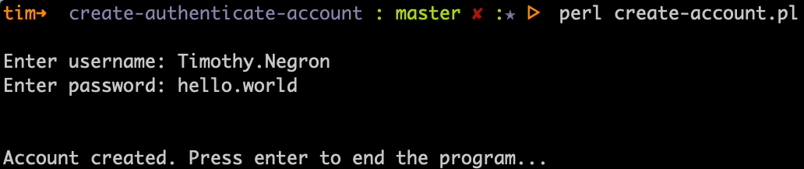
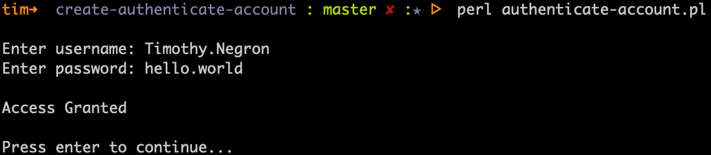
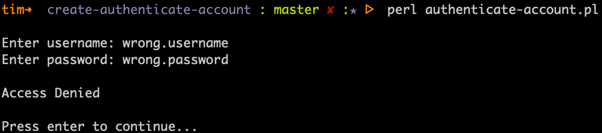

# Create Authenticate Account

### About

Two Perl scripts. The first scripts handles account creation. The second script authenticates accounts. Uses MD5 has for password.

### How To Use This App

1. `Fork` this repo
2. `Clone` is to your computer
3. Run `perl create-account.pl` (If using Windows 10, make sure you have perl installed.)
4. Create a username and password.
5. Run `perl authenticate-account.pl`

### Built With

* Perl
* MD5 Hash

### Description

The username and password will get stored in a file named userAccount.txt. When the account is created
for the first time, the password is encrypted with MD5 Hash and stored saved to the file that way. When
the account is being authenticated, the attempted password is encrypted with MD5 Hash before trying to match
the password.

### Pictures

##### Account creation:

##### Account Authentication (Access Granted):

##### Account Authentication (Access Denied):
